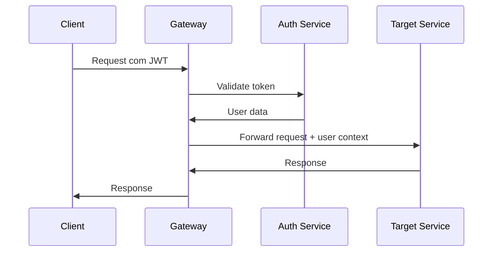

# API Gateway - E-commerce Microservices

Este é o API Gateway do sistema de e-commerce em microserviços. Ele atua como ponto único de entrada para todos os serviços do sistema.

## 🏗️ Arquitetura

O API Gateway implementa a **Opção 1: Validação Remota** para autenticação, onde:

- **Intercepta** todas as requisições
- **Delega** validação de tokens para o `auth-service`
- **Autoriza** acesso baseado em roles
- **Roteia** para os serviços apropriados

## 🚀 Funcionalidades

### ✅ Implementado

- **Proxy Inteligente**: Roteamento automático para microserviços
- **Autenticação Remota**: Validação via auth-service 
- **Autorização por Roles**: Controle granular de acesso
- **Rate Limiting**: Proteção contra abuse
- **Monitoramento**: Logs estruturados e health checks
- **Tratamento de Erros**: Error handling centralizado
- **Segurança**: Helmet, CORS, compressão

### 🔄 Fluxo de Autenticação



## 🛣️ Rotas

### Públicas
- `POST /api/auth/*` - Autenticação (rate limit: 10/15min)
- `GET /api/catalog/products*` - Listagem de produtos
- `GET /api/catalog/categories*` - Listagem de categorias

### Autenticadas
- `ALL /api/cart/*` - Carrinho (requer login)
- `ALL /api/orders/*` - Pedidos (requer login)  
- `ALL /api/payments/*` - Pagamentos (requer login)

### Admin
- `POST|PUT|DELETE /api/catalog/*` - Gestão de produtos
- `ALL /api/notifications/*` - Notificações

## 🔧 Configuração

### Variáveis de Ambiente

```bash
cp .env.example .env
```

```env
# Configuração básica
PORT=3000
NODE_ENV=development
LOG_LEVEL=info

# URLs dos serviços
AUTH_SERVICE_URL=http://localhost:3001
CATALOG_SERVICE_URL=http://localhost:3002
CART_SERVICE_URL=http://localhost:3003
ORDERS_SERVICE_URL=http://localhost:3004
PAYMENTS_SERVICE_URL=http://localhost:3005
NOTIFICATIONS_SERVICE_URL=http://localhost:3006

# CORS
ALLOWED_ORIGINS=http://localhost:3000,http://localhost:5173
```

## 🏃‍♂️ Como Executar

### Desenvolvimento
```bash
npm run dev
```

### Produção
```bash
npm run build
npm start
```

## 📊 Monitoramento

### Health Check
```bash
GET /health
```

Retorna o status de todos os microserviços:

```json
{
  "status": "healthy",
  "timestamp": "2025-08-29T10:00:00Z",
  "gateway": {
    "version": "1.0.0",
    "uptime": 3600,
    "memory": {...},
    "nodeVersion": "18.x"
  },
  "services": {
    "auth": { "status": "up", "responseTime": 45 },
    "catalog": { "status": "up", "responseTime": 32 },
    "cart": { "status": "up", "responseTime": 28 },
    "orders": { "status": "up", "responseTime": 51 },
    "payments": { "status": "up", "responseTime": 67 },
    "notifications": { "status": "up", "responseTime": 41 }
  }
}
```

### Logs
- `logs/combined.log` - Todos os logs
- `logs/error.log` - Apenas erros

## 🔒 Segurança

### Rate Limiting
- **Auth endpoints**: 10 requests/15min por IP
- **API geral**: 100 requests/15min por IP  
- **Leitura pública**: 200 requests/15min por IP

### Headers de Segurança
- CSP (Content Security Policy)
- HSTS (HTTP Strict Transport Security)
- X-Frame-Options, X-Content-Type-Options

### Autenticação
- Bearer token obrigatório para rotas protegidas
- Validação remota via auth-service
- Context do usuário enviado para microserviços

## 🧪 Testes

```bash
npm test
```

## 📋 Scripts Disponíveis

- `npm run dev` - Modo desenvolvimento com hot reload
- `npm run build` - Build para produção
- `npm start` - Iniciar em produção
- `npm run clean` - Limpar build
- `npm run lint` - Linting do código

## 🚀 Deploy

O serviço está preparado para deploy com Docker:

```dockerfile
FROM node:18-alpine
WORKDIR /app
COPY package*.json ./
RUN npm ci --only=production
COPY dist/ ./dist/
EXPOSE 3000
CMD ["npm", "start"]
```

## 📈 Próximos Passos

- [ ] Cache Redis para tokens
- [ ] Circuit breaker
- [ ] Métricas Prometheus
- [ ] Distributed tracing
- [ ] API versioning
